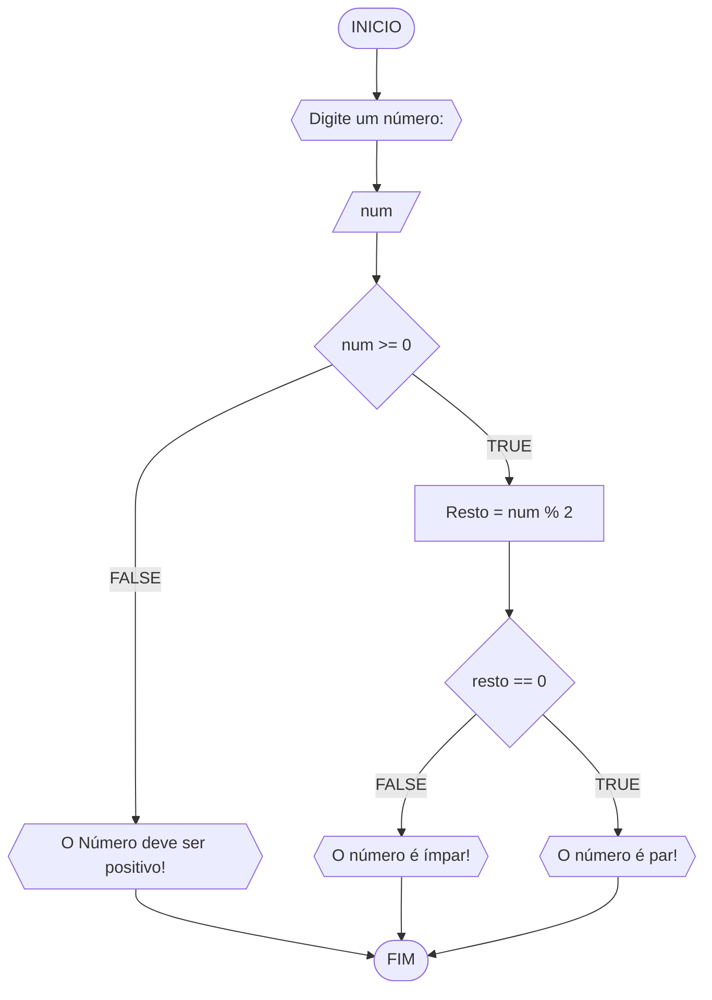

# UNIFOR
**Nome**: Diego rai Silva Germano Ribeiro <br>
**Disciplina**: Raciocinio lógico e algoritmo

## Lista de exercícios 01

### Exercício 3
Represente, em fluxograma e pseudocódigo, um algoritmo para determinar se um número inteiro e positivo é par ou impar.

#### Fluxograma


#### Pseudocódigo
```
ALGORITO verifica_par_impar
DECLARE num, resto: INTEIRO
INICIO
ESCREVA "Digite um número: "
LEIA num
SE num >= 0 ENTAO
	resto <- num % 2
	SE resto == 0 ENTAO
		ESCREVA "O número é par!"
	SENAO
		ESCREVA "O número é ímpar!"
	FIM_SE
SENAO
	ESCREVA ""O número não é positivo!"
FIM_SE
FIM
```

#### Teste
| num | num >= 0 | resto | resto == 0 | Saída |
| -- | -- | -- | -- | -- |
| -1 | False | | | "O número deve ser positivo" |
| 0 | True | 0 |True | "O número é par!" |
| 10 | True | 0 | True | "O número é par!" |
| 11 | True | 1 | False | "O número é ímpar!" |
