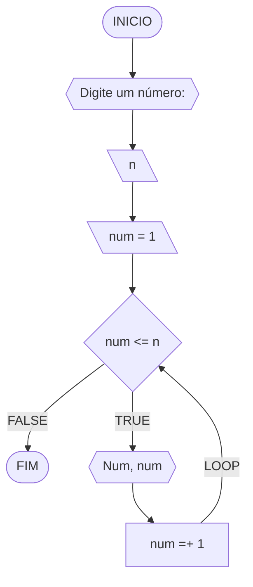
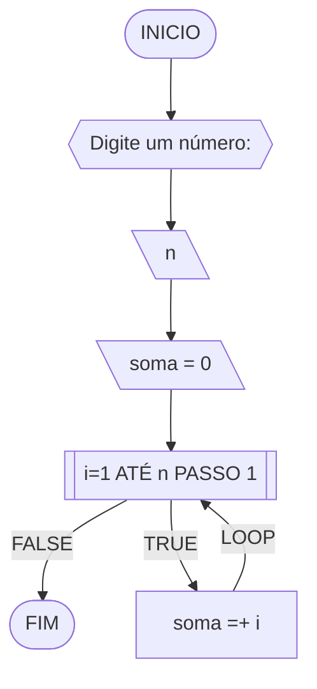
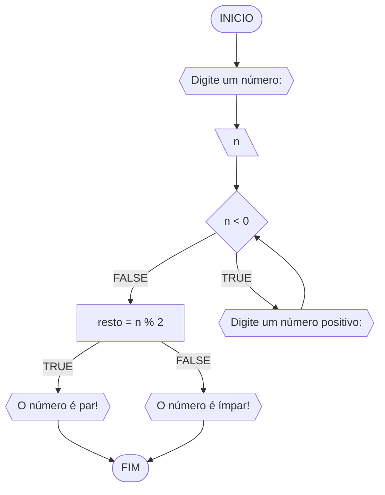
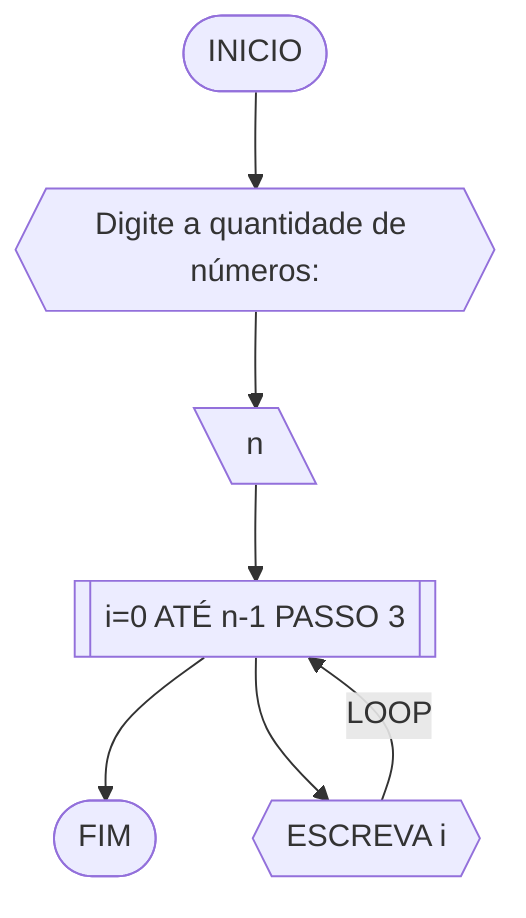
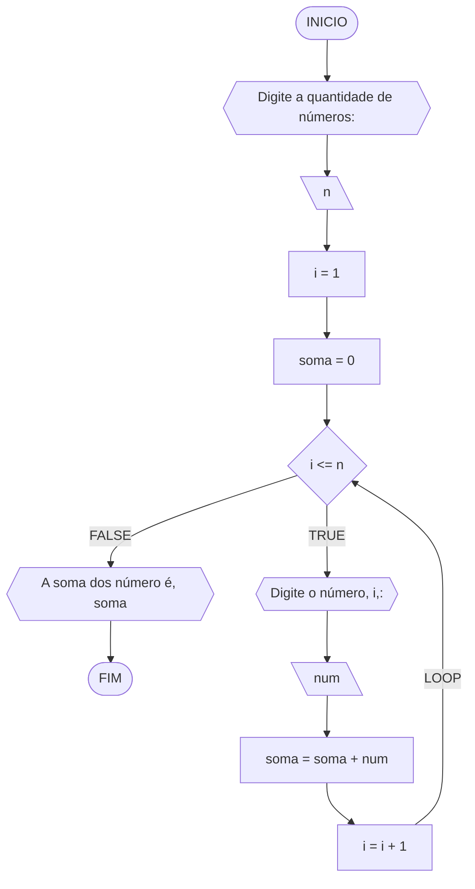
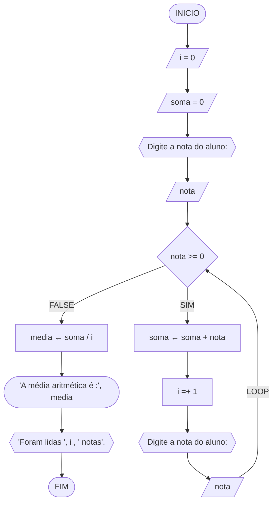

# UNIFOR
**Nome**: Diego Rai Silva Germano Ribeiro <br>
**Disciplina**: Raciocínio lógico algorítmo

## Exercício exemplo 1
Implemente e teste um programa que imprima os n primeiros números.

#### Fluxograma


#### Pseudocódigo
```
1 ALGORITMO print_n_primeiros
2 DECLARE n, num: INTEIRO
3 INICIO
4 ESCREVA “Digite um número: ”
4 LEIA n			// variável de entrada n
4 num ← 1			// variável num inicializada
5 ENQUANTO num <= n FAÇA	// n iterações
7	ESCREVA “Número ”, num
8	num ← num + 1		// num =+ 1 (incremento)
8 FIM_ENQUANTO
9 FIM
```

#### Teste de mesa
| it | n  | num | num <= n | Saída      | num =+ 1 |
| -- | -- | --  | --       | --         | --       |
| 1  | 10 | 1   | True     | Número 1   | 2        |
| 2  | 10 | 2   | True     | Número 2   | 3        |
| 3  | 10 | 3   | True     | Número 3   | 4        |
| 4  | 10 | 4   | True     | Número 4   | 5        |
| 5  | 10 | 5   | True     | Número 5   | 6        |
| 6  | 10 | 6   | True     | Número 6   | 7        |
| 7  | 10 | 7   | True     | Número 7   | 8        |
| 8  | 10 | 8   | True     | Número 8   | 9        |
| 9  | 10 | 9   | True     | Número 9   | 10       |
| 10 | 10 | 11  | True     | Número 10  | 11       |
| 11 | 10 | 11  | False    |            |          |

## Exercício exemplo 2
Implemente e teste um programa que some os n primeiros números.

#### Fluxograma


#### Pseudocódigo
```
1  ALGORITMO	soma_n_numeros()
2  DECLARE	n, i, soma: INTEIRO
3  INICIO
4  ESCREVA “Digite a quantidade de números: ”
5  LEIA n		// variável de entrada n
7  soma ← 0		// variável soma inicializada
6  PARA i DE 1 ATÉ n PASSO 1 FAÇA
7	soma ← soma + i	// soma =+ i (incremento)
8  FIM_PARA
9  ESCREVA “A soma é igual a ”, soma
10 FIM
```

#### Teste de mesa
| it | n  | soma | i  | soma =+ i |
| -- | -- | --   | -- | --        |
| 1  | 10 | 0    | 1  | 1         |
| 2  | 10 | 1    | 2  | 3         |
| 3  | 10 | 3    | 3  | 6         |
| 4  | 10 | 6    | 4  | 10        |
| 5  | 10 | 10   | 5  | 15        |
| 6  | 10 | 15   | 6  | 21        |
| 7  | 10 | 21   | 7  | 28        |
| 8  | 10 | 28   | 8  | 36        |
| 9  | 10 | 36   | 9  | 45        |
| 10 | 10 | 45   | 10 | 55        | 

## Lista de exercícios 03


### Exercício 01 (2.5 pontos)
Atualize o algoritmo para determinar se um número inteiro e positivo é par ou ímpar, usando uma laço condicional para aceitar apenas números maiores ou iguais a zero. 

#### Fluxograma (1.0 ponto)


#### Pseudocódigo (1.0 ponto)

```
Algoritmo ParImpar
DECLARE n, resto: INTEIRO
ESCREVA "Digite um número: "
INICIO
LEIA n
SE n < 0 ENTAO
	ENQUANTO n < 0 FAÇA
		ESCREVA "Digite um número positivo: "
	FIM_ENQUANTO
SENAO

FIM_ALGORITMO
```

#### Teste de mesa (0.5 ponto)

| nome_coluna1 | nome_coluna2 | nome_coluna3 | nome_coluna4 | nome_coluna5 | 
|      --      |      --      |      --      |      --      |      --      | 
| Adicione     | espaço       | se quiser    |  alinhar     | as barras    |
| verticais,   | mas          | não é        | obrigatório. | Entendido ?  |

### Exercício 02 (2.5 pontos)
Faça um algoritmo que exiba na tela uma contagem de 0 até 30, exibindo apenas os múltiplos de 3.

#### Fluxograma (1.0 ponto)



#### Pseudocódigo (1.0 ponto)

```
ALGORTIMO MultiploTres
DECLARE n: INTEIRO
INICIO
ESCREVA "Digite a quantidade de números:"
LEIA n
PARA i DE 0 ATÉ n-1 PASSO 3 FAÇA
	ESCREVA i
FIM_PARA
FIM
```

#### Teste de mesa (0.5 ponto)

| it | n   | i  | saida | 
| -- | --  | -- | --    |    
| 1  | 7   | 0  | 0     |
| 2  | 7   | 3  | 3     |
| 3  | 7   | 6  | 6     |

### Exercício 03 (2.5 pontos)
Dada uma sequência de números inteiros, calcular a sua soma. 
Por exemplo, para a sequência {12, 17, 4, -6, 8, 0}, o seu programa deve escrever o número 35.

#### Fluxograma (1.0 ponto)



#### Pseudocódigo (1.0 ponto)

```
ALGORITMO SomaValores
DECLARE n,i: INTEIRO; soma,num: REAL
INICIO
ESCREVA "Digite a quantidade de números:"
LEIA n
soma <- 0
i <- 1
ENQUANTO i <= n FAÇA
	ESCREVA "Digite o número", i,":"
	LEIA num
	soma <- soma + num
	i <- i + 1
FIM_ENQUANTO
ESCREVA "A soma dos número é", soma
FIM
```

#### Teste de mesa (0.5 ponto)

| n  | soma | i  | i <= n | num | soma + num | i + 1   | saída                      |  
| -- | --   | -- | --     | --  | --         | --      | --                         |
| -1 | 0    | 1  | False  |     |            |         | A soma dos número é 0      |
| 0  | 0    | 1  | False  |     |            |         | A soma dos número é 0      |
| 3  | 0    | 1  | True   | 10  | 0+10 = 10  | 1+1 = 2 |                            |
| 3  | 10   | 2  | True   | 20  | 10+20 = 30 | 2+1 = 3 |                            |
| 3  | 30   | 3  | True   | 30  | 30+30 = 60 | 3+1 = 4 |                            |
| 3  | 60   | 4  | False  |     |            |         | A soma dos número é 60     |

### Exercício 04 (2.5 pontos)
Escreva um programa que leia a nota de diversos alunos, até que seja digitada uma nota negativa. 
Nesse momento, ele mostra a média aritmética de todas as notas lidas e quantas notas foram lidas. 
Ex. Foram lidas 14 notas. A média aritmética é 6.75!

#### Fluxograma (1.0 ponto)



#### Pseudocódigo (1.0 ponto)

```
ALGORITMO_Media
DECLARE nota, media, i, soma: Int
i = 0
soma = 0
ESCREVA "Digite a nota do aluno: "
LEIA nota
ENQUANTO nota >=0 FAÇA
	soma ← soma + nota
	i  =+ 1
	ESCREVA "Digite a nota do aluno:"
	LEIA nota
FIM_ENQUANTO
media ← soma / i
ESCREVA "A média aritmética é :", media
ESCREVA "Foram lidas ", i , " notas"
FIM_ALGORITMO
```

#### Teste de mesa (0.5 ponto)

| nota | SE nota >= 0 | soma ← soma + nota | i = + 1 | media ← soma / i  | SAÍDA 1 |SAÍDA 2
|----------|----------|----------|----------|----------|----------|----------|
|     5      |     V     |     5 ← 0 + 5     |    1      |          |
|     2    |       V   |       7 ← 5 + 2   |      2    |         |
|     3     |      V    |      10 ← 7 + 3    |     3     |          |
|     10     |      V    |      20 ← 10 + 10    |     4     |          |
|     8     |      V   |      28 ← 20 + 8    |     5    |         |
|     -1     |      F    |          |         |   5.6 ← 28 / 5       |  "A média aritmética é : 5.6"        | "Foram lidas 5 notas"
